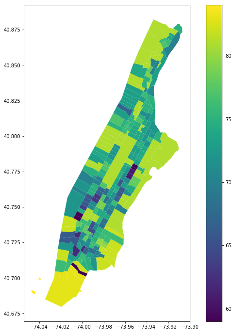

+++
title = "My presentation"
outputs = ["Reveal"]

[reveal_hugo]
theme = "moon"

+++

### 'Rough' City for Better Air Quality

Ran Ma_VizTech_Spring 21

---



### Abstract

{}

The research focus on the relation between urban space and urban air quality on the mesoscale and microscale level. Manhattan is the targeted research urban area.

---

The spacial factors of the city, which are extracted from building configurations, are examined to establish a correlation with the local air quality by different time of the day.

{}

---

### Introduction

{}

Every year air pollution contributes to millions of early death globally. Residents of the city suffer more from the polluted air. The most common pollutants are fine particulate matter(PM2.5), ground level ozone, and nitrogen dioxide.

---

The source of pollutants could be factories emission, agriculture production, car emission, and even cooking exhaust. Both transboundary pollution coming from the periphery area and local pollution contribute to the air pollution in the city.

---

The building of the city which composes of high-rise and low-rise building change the topography of the land, influencing the wind and air-flow in the urban space. A 'rough' city with high-rise building obstructs the air-flow near the ground.

---

By compressing the air going through the intervals between buildings, high-rise buildings creates a strong convection on the street of city grid. The pollutant either produced by local vehicles or transported from the periphery relies on air convection to disperse and to dissipate.

{}

---

### Methodology

{}

##### Air Quality

The air quality data is scraped from Breezometer API, with columns of region_id (US census tract number), aqi (air quality index), and pollutant type (including o3, pm10, and no3).

---

##### Air Quality
The census tract divides the Manhattan island into 288 geolocation zone.

---

##### Air Quality
The data is extracted by different times of the day: morning (6 am), noon (1 pm), evening (6 pm), and night (11 pm).

---

##### Air Quality
With the amount limit of scraping the air quality data, the data from three consecutive days (30-03-2021, 31-03-2021, and 01-04-2021) are extracted in order to obtain the mean of aqi for each geolocation at different times of the day.

---

##### Urban Space Factors
The Manhattan building profile is from PLUTO. The building footprint is also obtained.
The following features of urban spacial factors are created from the raw data:

---

##### Building height
('heightroof')
  : is the average of every building roof height within the same census tracts zone.  

---

By compressing the air going through the intervals between buildings, high-rise buildings creates a strong convection on the street of city grid. The pollutant either produced by local vehicles or transported from the periphery relies on air convection to disperse and to dissipate.

{}

---

### air Quality

  

    
  

  

    
  

  

    
  

---

### air quality
